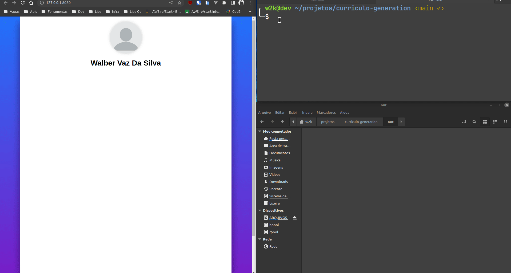

<div align="center">
  
  <h1>Projeto de geração de currículo</h1>
  <p>projeto de geração de currículo em PDF a partir de um arquivo HTML, CSS e JS</p>
</div>

## Por que?

A ideia é que seja possível gerar um currículo em PDF a partir de um arquivo HTML, CSS e JS. Assim, é possível ter um currículo mais dinâmico e com mais possibilidades de personalização.

## Como?

O projeto utiliza o [Puppeteer](https://github.com/puppeteer/puppeteer) para gerar o PDF a partir de um arquivo HTML. O arquivo HTML e o CSS criados e editados pelo usuário são convertidos em um arquivo pdf com o comando `npm run build`. O arquivo PDF é gerado na pasta `out`.

## Como usar?

1. Clone o repositório

2. Instale as dependências

```bash
npm install
```

3. Edite o arquivo `src/index.html` e `assets/css/style.css` com as informações do seu currículo e imagens na pasta `assets/img` (se necessário) e execute o comando:

```bash
npm run build
```

4. O arquivo PDF será gerado na pasta `out`

5. Usando live server para visualizar o currículo

```bash
npm run start
```

## Fetures para implementar

- [ ] Gerar mais paginas no PDF
- [ ] Adicionar mais informações no currículo
- [ ] Adicionar mais estilos ao currículo
- [ ] Adicionar mais opções de personalização
- [ ] Adicionar mais opções de exportação

## LICENSE

[MIT](LICENSE) &copy; [Walber Vaz - 2023](https://github.com/walber-vaz)

## Autor

[Walber Vaz](https://github.com/walber-vaz)

## Como contribuir?

1. Faça um fork desse repositório

2. Crie uma branch com a sua feature: `git checkout -b minha-feature`

3. Faça commit das suas alterações: `git commit -m 'feat: Minha nova feature'`

4. Faça push para a sua branch: `git push origin minha-feature`

5. Abra um Pull Request
